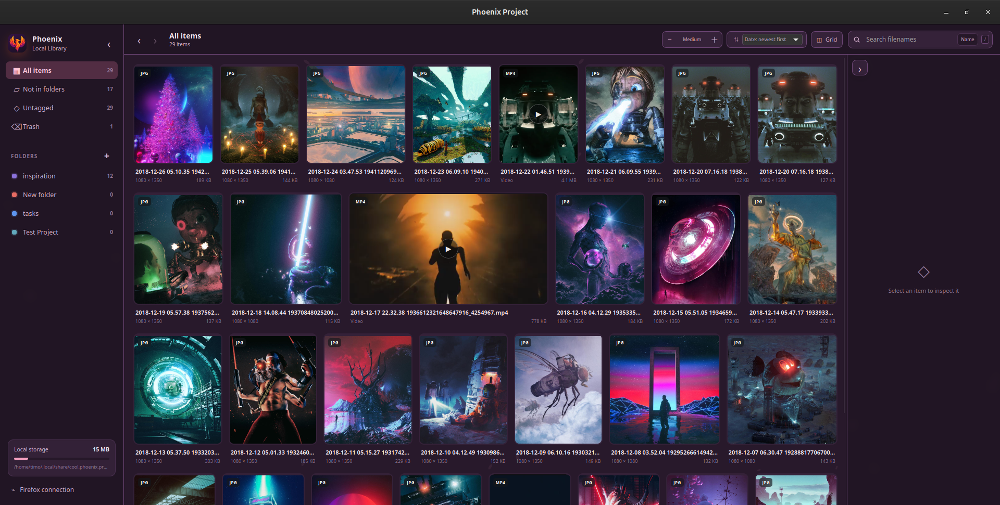
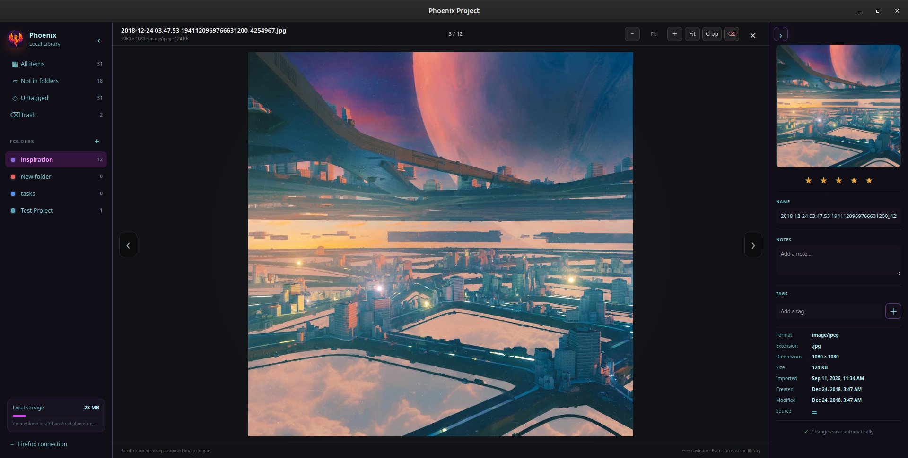
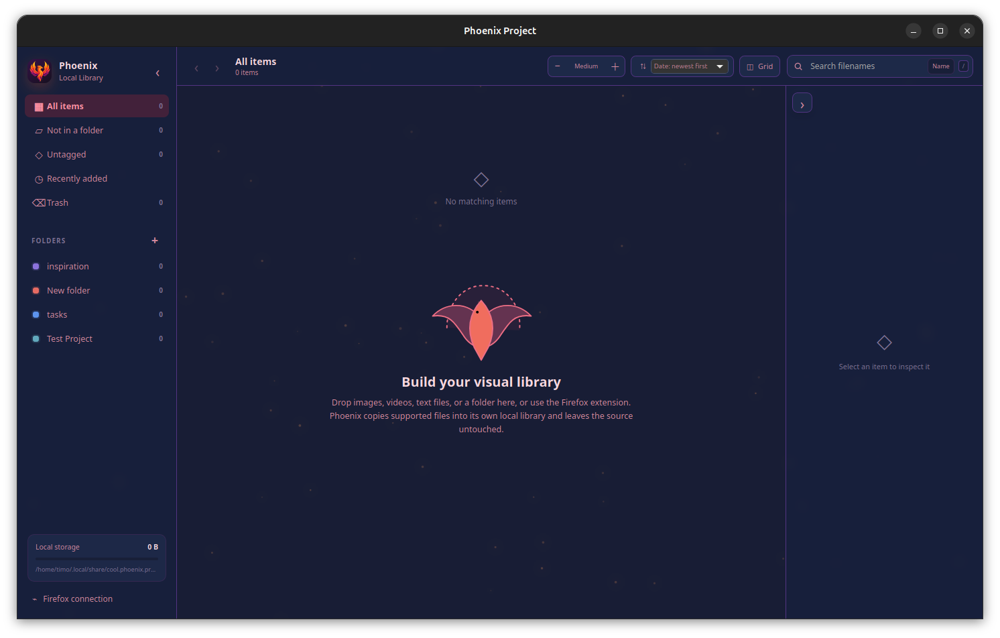
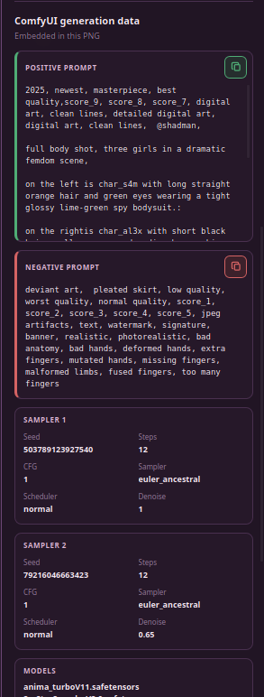

# Phoenix Project

Phoenix is a visual library for Linux. It gives images, videos, GIFs, and text files one organized home without changing the original files you import.



## What Phoenix does

- Organizes visual files with folders, tags, ratings, search, and sorting.
- Imports and exports with normal drag and drop on Linux and Wayland.
- Opens images, GIFs, videos, and text files in a built-in viewer.
- Captures images and videos from Firefox with the included browser extension.
- Shows useful generation information stored inside supported AI images.
- Offers customizable layouts, previews, navigation, and animated themes.
- Keeps the library local on your computer.

<table>
  <tr>
    <td width="50%"></td>
    <td width="50%"></td>
  </tr>
  <tr>
    <td align="center">A focused viewer with the library still within reach</td>
    <td align="center">A simple starting point for a new local library</td>
  </tr>
</table>

### AI image information

Phoenix can read supported generation details embedded in images and present them in a clear inspector.



## Download

The current version is **0.1.35**. Download the Ubuntu package or portable AppImage from [Releases](../../releases/latest).

- **Ubuntu package:** install the `.deb` file through the software installer.
- **Portable version:** make the `.AppImage` executable and open it directly.
- **Firefox extension:** download the extension archive from the same release.

Phoenix currently targets modern Ubuntu desktops using GNOME and Wayland.

## Firefox extension

The optional extension sends images and videos from Firefox directly to Phoenix. Open Phoenix's Firefox connection section, then follow the pairing instructions shown in the app.

The extension is not yet available from Mozilla Add-ons and the downloadable archive is currently unsigned.

## Future roadmap

- A clearer import queue with progress, cancellation, and crash recovery.
- Watched folders that automatically bring new files into the library.
- Smart folders and more flexible filtering.
- Duplicate and visually similar image detection.
- Stacks for grouping versions and related files.
- Deeper ComfyUI workflow support and generation comparison.
- A faster image-and-caption editing workflow.
- Simple library backup, restore, and multiple-library support.

The roadmap is directional and may change as Phoenix develops.

## Development

Phoenix uses Tauri, Rust, SQLite, and a dependency-light web interface.

```bash
cargo run -p phoenix-project --bin phoenix-project
```

Frontend tests can be run with:

```bash
npm test
```

## Project status

Phoenix is an early-stage independent project. Keep a backup of important files while testing new releases.
